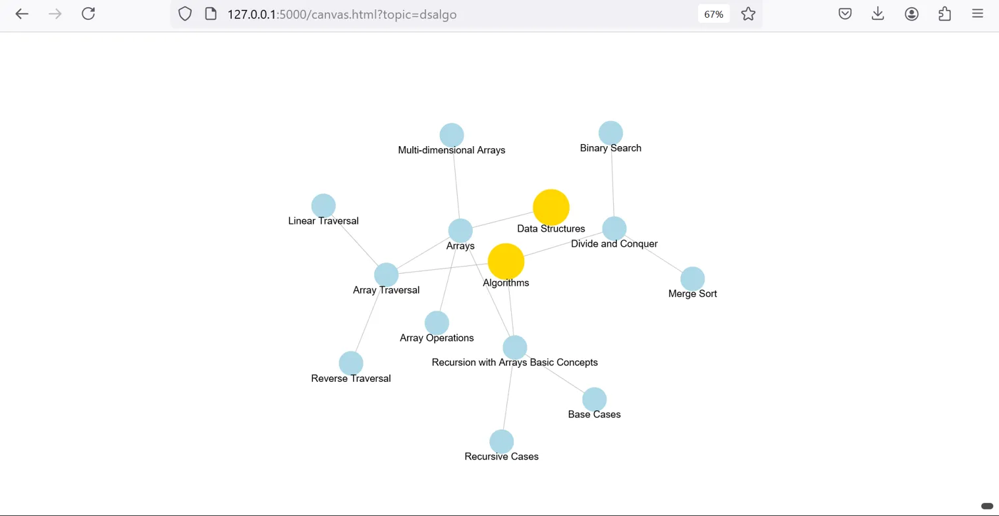
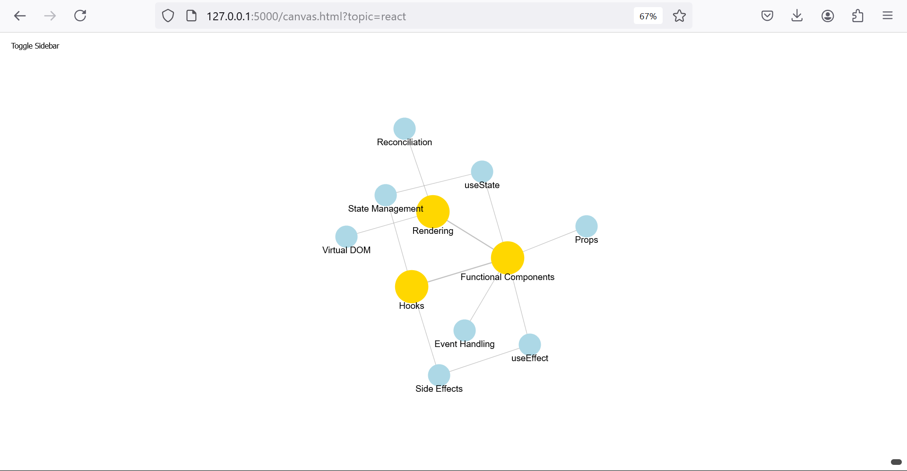
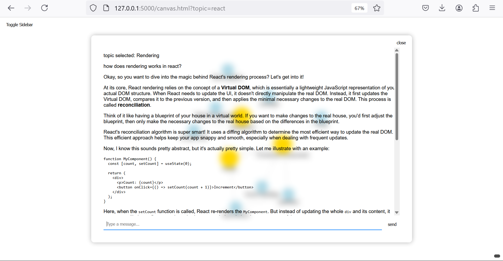

# knowledge base organization

this project focuses on organizing and managing a knowledge base with features for document categorization, topic extraction, and interactive exploration through a visual knowledge graph.

## features

- **auto categorization**: automatically categorize new documents and topics
- **knowledge graph**: visualize relationships between topics
- **topic-based exploration**: dive into specific topics through an interactive interface
- **summarization**: generate concise summaries of documents and topics
- **tag extraction**: identify and extract relevant tags from documents

## setup and usage

1. install required dependencies:
   ```
   pip install python-dotenv google-generativeai flask tiktoken
   ```

2. set up your environment variables in a `.env` file:
   ```
   api_key=your_generative_ai_api_key_here
   ```

3. run the main application:
   ```
   python app.py
   ```

4. access the visual interface at `http://127.0.0.1:5000/canvas.html?topic=your_topic`

## visual interface

the project includes an interactive visual interface for exploring topics. here are some examples:

### data structures and algorithms


this graph shows the relationships between various data structures and algorithms topics.

### react concepts


this graph illustrates key concepts in React and how they relate to each other.

### topic exploration


users can explore specific topics in detail through an interactive interface.

## maintaining the knowledge base

to keep the knowledge base up-to-date, run the following scripts in order:

1. `python extract_tags.py`
2. `python summarize.py`
3. `python compile_summary.py`
4. `python update_knowledge_graph.py`

## adding new topics

1. create a new `{topic}.json` file in the `nodes/` directory
2. create a corresponding `{topic}.txt` file in the `topics/` directory

## notes and limitations

- currently supports up to 5 relevant tags for articles in the sidebar
- `tags.json` serves as a history and is not affected by node deletions
- large documents and projects may require additional processing

## todo

- [ ] implement voice support for more interactive exploration
- [ ] add functionality for retrieving past conversations
- [x] implement auto-categorization of topics
- [x] add response streaming for faster interactions

## contributing

contributions are welcome! please fee